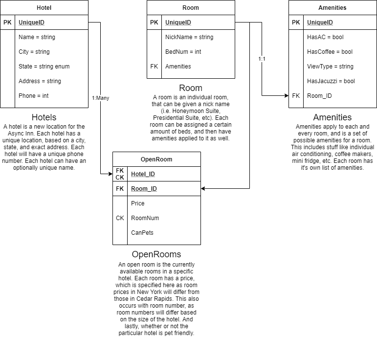

# Lab10-ERD
Starting by building an ERD, this will become a database project.

This database is meant to build out to store anything that one might need to know about various hotels.  
These are the various tables that are/will be inside the database.  
  
### Hotel
Hotels are created as exactly that - a new hotel. They'll have a name, address, city, state, and phone number.  

### Room
Rooms are created and will eventually be able to be connected to the individual hotels. Each room will have a nickname and a layout.  
  
### Amenities
Amenities are what a room includes in it. Amenities can be created for a room, such as a fridge, a jacuzzi, a nice view, etc.  
  
#### Connections
Each of these tables will have connections between each other. These connections will make it so rooms can be created for different hotels. Amenities can constantly be added to individual rooms.  
  

